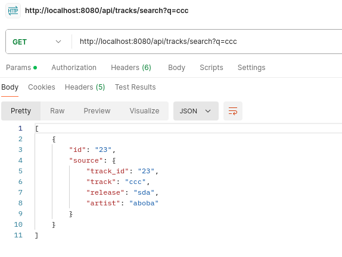
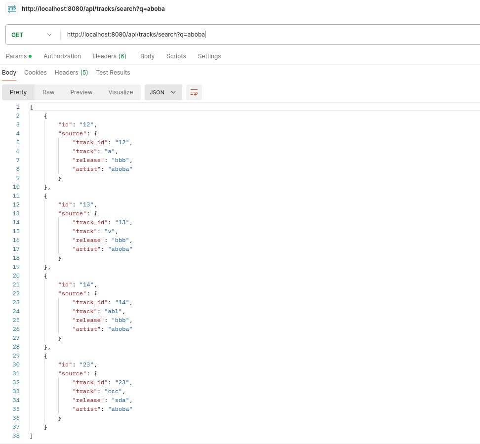
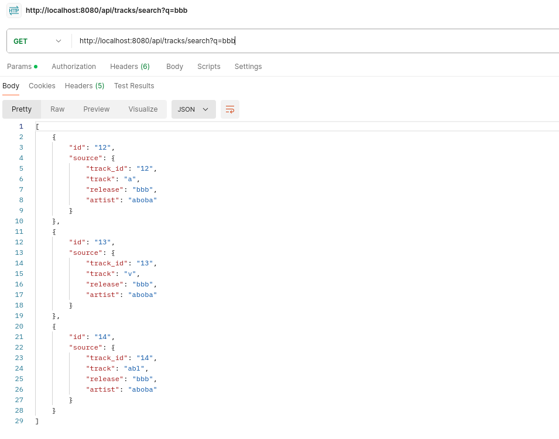

#### запуск

(все команды выполняются из корневой папки сервиса search)

запускаем котейнеры

```
docker-compose up -d
```

создаем индекс в эластике
```
curl -u elastic -X PUT "http://localhost:9200/tracks" \
-H "Content-Type: application/json" \
-d '{ "settings": {"number_of_shards": 1, "number_of_replicas": 1 }, "mappings": { "properties": { "track_id": { "type": "text" }, "track": { "type": "text" }, "release": { "type": "text" }, "artist": { "type": "text" }}}}'
```

получаем аи ключ для эластика
```
curl -X POST "http://localhost:9200/_security/api_key" \
  -H "Content-Type: application/json" \
  -u elastic:elastic \
  -d '{
    "name": "my-api-key",
    "role_descriptors": {
      "my-role": {
        "cluster": ["monitor"],
        "indices": [
          {
            "names": ["tracks"],
            "privileges": ["read", "index"]
          }
        ]
      }
    }
  }'
```

нам понадобится строка, лежащая под ключом "encoded". Ее записываем в поле *elasticsearch.api-key=* в файл **search/resources/application.properties**


Стартуем наш сервис командой 

```
 mvn spring-boot:run
```


Сервис подключается к топику кафки (по дефолту localhost:9092 tracks-topic - это все настраивается в файле application.properties)


пишем в кафку любым удобным способом (для тестов писал вручную)
```
docker exec -it search-kafka-1 kafka-console-producer \
  --bootstrap-server localhost:9092 \
  --topic tracks-topic
```

и в консоль записываем тестовые данные
```
{"track_id": "12", "track": "a", "release": "bbb", "artist": "aboba"}
{"track_id": "13", "track": "v", "release": "bbb", "artist": "aboba"}
{"track_id": "14", "track": "abl", "release": "bbb", "artist": "aboba"}
{"track_id": "23", "track": "ccc", "release": "sda", "artist": "aboba"}
```


(в релизе в этот топик кафки пишутся все изменения в оригинальной бд --- в эластике храняться лишь данные про трек, альбом, автора, и айди трека)

далее можем осуществлять наш поиск 
```
http://localhost:8080/api/tracks/search?q=<yourquery>
```








